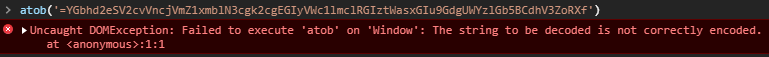

# Candidate-Challenges.org - Cipher Flag
Jonathan Gregson, 26 August 2020

## Findings
While browsing an interesting website (hxxp://candidate-challenges.org/challenges/) I found a string of text. While appearing random at first, this text began to resemble a base64-encoded string. But I was not able to decode it:

I noted that this string had the equals sign at the beginning of the string, but this character (used as padding when the last encoded block is too short) is supposed to appear on the end of the string. I reversed the string before decoding it and was able to get something back this time:

I was getting somewhere now, but I couldn't read gibberish, and actually still can't. Once again, this string appeared to be what I expected, but reversed. Simply reversing the output one final time gave me the flag:

## Flags
- flag{Resourcefulness is a required skill not easily taught}
