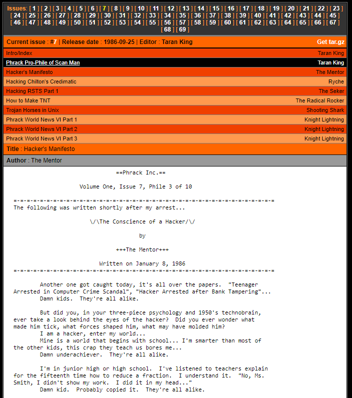

# Candidate-Challenges.org - Forensics Flag
Jonathan Gregson, 26 August 2020

## Findings
While browsing an interesting website (hxxp://candidate-challenges.org/challenges/) I found links to some PCAP files. "I wonder if some fool captured their plaintext creds in here" I thought to myself as I downloaded the files.

The first PCAP file showed two HTTP streams as the client (192.168.0.109) asked the server ec2-3-20-143-21.us-east-2.compute.amazonaws.com (3.20.143.21) to get `/challenges/` and associated files twice. One thing that jumped out was a little `FTP-DATA` packet between the requests for `/challenges/`. Inspecting the data in the packet revealed a flag:

`FLAG: flag{C01_l00ks_sUspici0us}`

This flag seemed more like a hint, and I was supposed to find out what was suspicious about `C01`. When I find out what `C01` is referring to I'll investigate its suspiciousness.

>TODO: Find out what C01 is and why it is suspicious.

I spent some time trying to figure out what was happening in the captured HTTP streams, and I had two ideas of what was being portrayed:

 - **Server was attacking the client**: My first thought was that the server had sent the client a malicious payload of some kind leading to RCE. The flag is supposed to emulate data exfiltration from the client back to the server. However, I couldn't find anything malicious in what the server sent to the client in response to the first or second request.

 - **Client was attacking the server**: My second thought was that the client was attacking the server. In the first connection the client was simply checking what the server ordinarily sent. The FTP-DATA could represent an RCE exploit, or even a simple FTP file upload. The second request was the client checking if the server was now serving their malicious payload. However, the server's response was the same to both requests.

At that point I started looking at the second PCAP. The second file appeared to contain packets between the same client and another server ec2-18-219-169-113.us-east-2.compute.amazonaws.com (18.219.169.113). It had just three TCP packets: `SYN`, `SYN-ACK`, and `RST`:

Ordinarily we would expect the third packet to be an `ACK` packet, as the client acknowledges the server's acknowledgment, completing the TCP three-way handshake and establishing a TCP connection. However, the third request was an `RST` packet, indicating that the client wanted to close the connection.

What was happening here is called a "half open" scan. The client was attempting to verify that the server had an active TCP listener on that port (1337). The server's `SYN-ACK` tells us that the was a TCP listener on that port at the time.

Not wanting to leave well enough alone I decided to see what the client could have been looking for on port 1337 and connected myself:

What I got back appeared to be base64-encoded data. I attempted to decode it and got back some gibberish, appearing to be compressed or binary data:

Still, I could see the word "flag" in the output, so I figured that I was close, and this just needed some more decoding and coercing. But how? There are too many encoding and compression algorithms and I didn't want to try all of them manually. I turned to GCHQ's [CyberChef](https://gchq.github.io/CyberChef/) to see if its "Magic" function could make more sense of the data than I could:

And sure enough, CyberChef came back with the flag. That the data was simply the flag as plaintext, gzipped and then base64-encoded.

`flag{aHR0cDovL3BocmFjay5vcmcvaXNzdWVzLzcvMy5odG1s}`

Once again I thought the flag looked like encoded data and asked CyberChef to figure it out, and CyberChef came through:

Following the link lead to a Phrack phile:

## Flags
- flag{C01_l00ks_sUspici0us}
- flag{aHR0cDovL3BocmFjay5vcmcvaXNzdWVzLzcvMy5odG1s}
