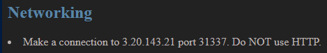
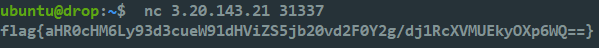
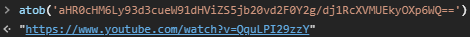
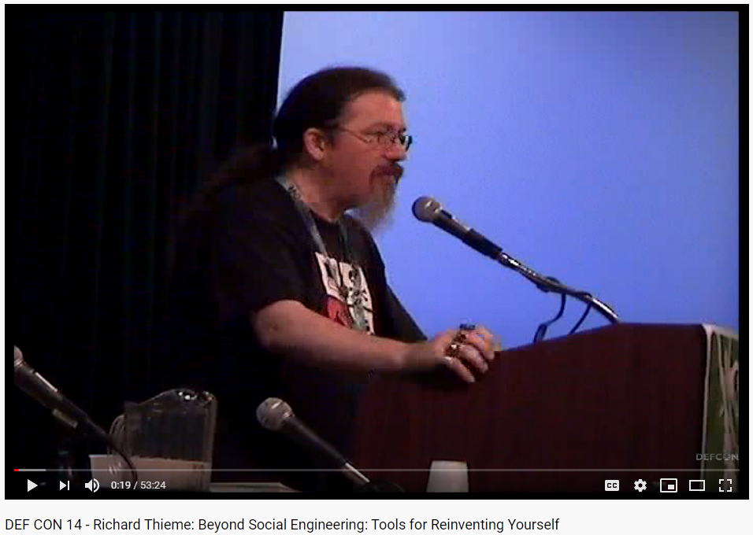
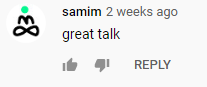

# Candidate-Challenges.org - Networking Flag
Jonathan Gregson, 26 August 2020

## Findings
While browsing an interesting website (hxxp://candidate-challenges.org/challenges/) I was challenged by a list item to connect to an arbitrary IP address on a high port number:

I don't usually follow the advice of `li` tags that aren't nested in an `ol` or `ul`, but this time it was different. This `li` talked to me like it knew me, and I somehow knew that my future depended on this, this... connection.

I had to do it.

Despite how inviting this challenge was, I wasn't about to put my beloved laptop at risk. My main concern was that the remote server was going to exploit a 0-day in my OpenSSH client and pop a shell on *my* box. I know what you're thinking: "Nobody is going to burn a high value 0-day trying to hack your silly computer". And you're probably right. The keyword there being "probably." Even if there was little risk, it still wasn't a risk I was going to take.

Instead I decided to become like them. I would become an `li` tag. I mean an EC2 instance. Once logged into one of my EC2 boxes I took the leap:

After executing the command and cringing in fear I slowly opened my eyes. Expecting to see CryptoLocker already demanding my BitCoin I was instead greeted by some text, appearing to be a flag:

`flag{aHR0cHM6Ly93d3cueW91dHViZS5jb20vd2F0Y2g/dj1RcXVMUEkyOXp6WQ==}`

Recognizing a portion of flag as base64-encoded data, I decoded it to see what horrors lied within:

*A wild URL appears*

I recognized this as a URL to one of my favorite websites, YouTube. After considering what might lie at the end of this URL I started to get paranoid again. My YouTube recommendations were in a good place and I didn't want to mess that up. Worse, there could be a comment there executing a stored XSS payload which would compromise my Google account.

Again, I know what you are thinking. "Stored XSS in YouTube comments leading to account takeover could be a Million-dollar vuln. With a capital M." And again, you are probably right. But we have all chosen our threat model and I will stick with mine.

What could be done then? Incognito mode would protect my account and recommendations from attack, but not my browser. I decided to open this site in Windows Defender Application Guard so that any code execution was contained within the Krypton container:

At long last I was looking at it. This is what the `li` wanted me to see. I guess this wouldn't have hurt my recommendations after all.

## Flags
- flag{aHR0cHM6Ly93d3cueW91dHViZS5jb20vd2F0Y2g/dj1RcXVMUEkyOXp6WQ==}
