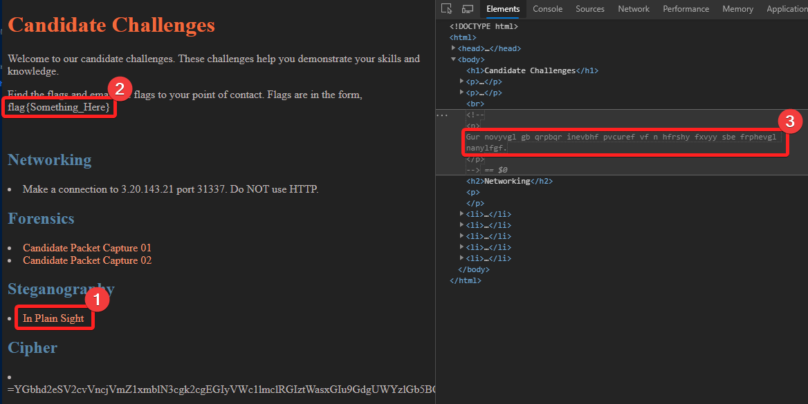
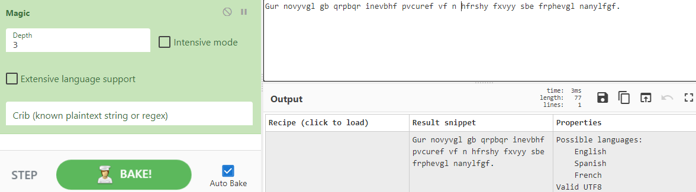
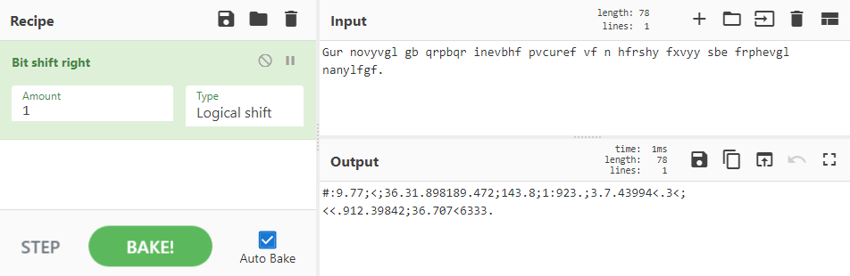
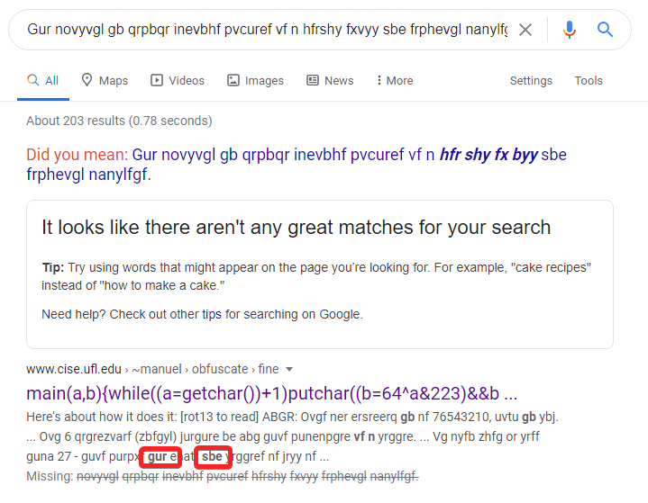
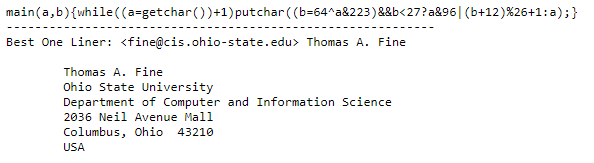
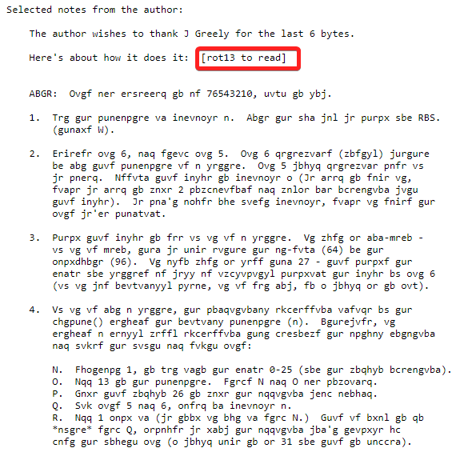
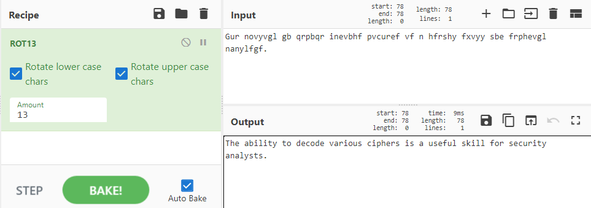
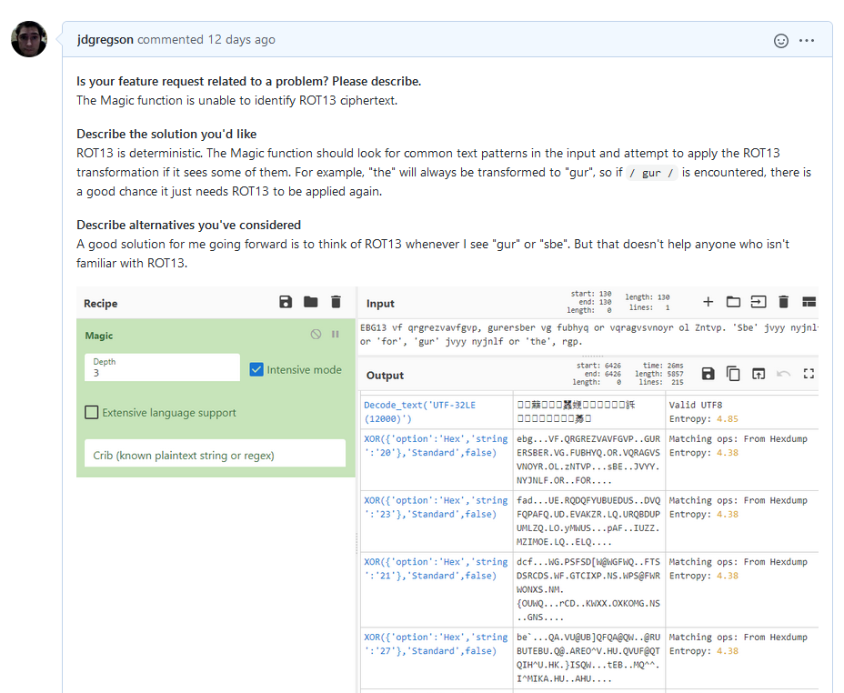

# Candidate-Challenges.org - Steganography Flag
Jonathan Gregson, 26 August 2020

## Initial Findings
While browsing an interesting website (hxxp://candidate-challenges.org/challenges/) I found a flag in plain sight. There was a clue that said the flag was in plain sight and linked to the itself. When I found the flag it said there was something there:

1)  This was a hint, and the fact that it links to itself indicates that the hint is specifically about being in plain sight, right here.
2)  This was the flag: `flag{Something_Here}`
3)  This was randomly typed text, a red herring.

As mentioned in 3 above, there was also a commented-out paragraph containing the string `Gur novyvgl gb qrpbqr inevbhf pvcuref vf n hfrshy fxvyy sbe frphevgl nanylfgf.` The text looked readable, and CyberChef thought I should be able to read it as well:

But after running it through anagram finders a bunch of different ways and thinking about the literalness of the statements on the page, I just felt that this was randomly typed text meant as a distraction. I closed my eyes and typed random sentences and came up with similar words which almost made sense individually, but not taken together.

There was also a flag when you view source on the `/challenges/` page: `flag{Vi3w_s0urc3}`

There was nothing particularly interesting to me about this flag, other than that fact that it was automatically nested in `<li>` tags by Chrome when you open developer tools, and you must dig for it. But if you view source, it is right at the bottom of the page. Firefox does not move the comment around in the same way.

## Followup Findings
The findings above were my initial take, but it just didn't sit right with me for several days. I couldn't shake the feeling that I was wrong to conclude that it the "Gur novyvgl gb" text a red herring. It still looked readable, almost like a substitution cipher or some simple transformation had been applied to an actual plaintext. I looked around the page for some clues as to how many shifts it might need, tried one or two bits in either direction, but couldn't really get anything useful:

I wasn't getting anywhere and decided to see if anyone had seen this ciphertext online before and pasted it into Google. Unsurprisingly there were no exact matches found. But there was a result with a snippet of code and a few of the same patterns of text:

The search result brought me to a technical paper about a one-line implementation of _something_:

Further down the page were some paragraphs of obfuscated text, and a hint that ROT13 was required to read it:

I had heard of ROT13 and thought I saw it in CyberChef before, but hadn't looked into what it is or does. A quick Google search revealed that it's just a substitution cipher. Plugging the text into CyberChef and asking it to run the ROT13 algorithm over it revealed the readable text "The ability to decode various ciphers is a useful skill for security analysts.":

This isn't a flag, and the hidden comment may have been a red herring after all. If so, it succeeded at distracting me for some time. In the end I opened a feature request with the CyberChef team to have the "Magic" function detect words like "gur" and "sbe" in text and recognize it as ROT13-encoded data:

## Flags
- flag{Something_Here}
- flag{Vi3w_s0urc3}
